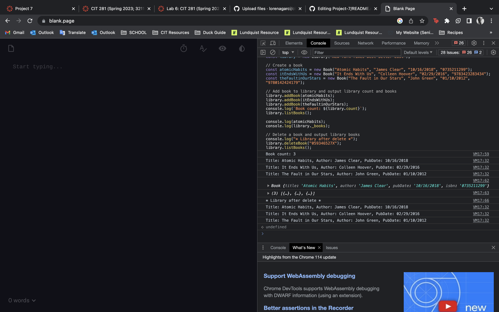

In this lab, I was able to familiarize myself with GitHub and gain experience working with classes in JavaScript. 
I began by first joining  GitHub and complete the Introduction to GitHub course! 

I was tasked with creating a lab file where I was able to document my progress and code throughout the lab which serve as a reference and a way to track my work. I learned that classes are a fundamental concept in object-oriented programming and allow you to create objects with shared properties and methods.

I then created and tested a Book class where I implemented the necessary functionality to represent a book object, such as storing its title, author, and publication year. 

I then created and tested a Library class which served as a container for multiple book objects. I added support for the International Standard Book Number (ISBN) and implemented a delete book method, allowing me to remove books from the library based on their ISBN.

Through this lab I gained familiarity with GitHub and its functionalities but also strengthened my understanding of classes in JavaScript and their practical implementation in building a Book and Library system.

Below is an image of the output of the completed javascript file: 

